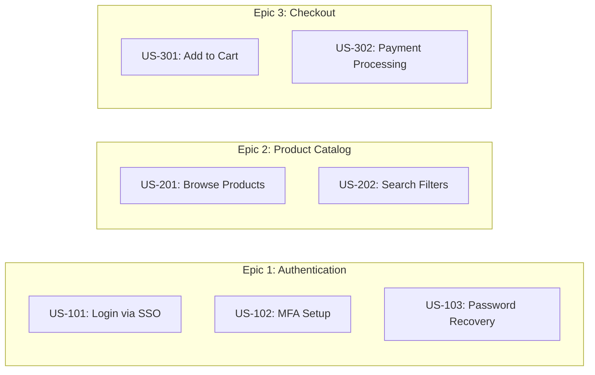

# Story Mapping

## Prerequisites

| Tool | Check | Install |
|------|-------|---------|
| Node.js >= 18 | `node --version` | [https://nodejs.org](https://nodejs.org) |
| npx | `npx --version` | Included with Node.js |

> mermaid-cli is auto-downloaded via `npx -y` — no manual install needed.

## When to Use

Use this skill when the user asks to create a story map, user story board,
epic breakdown, or backlog visualization. The output follows the Jeff Patton
story mapping format: personas across the top, epics as horizontal swim-lanes,
and user stories as cards within each epic, ordered by priority.

## Output Location & Format (REQUIRED)

Write story-map outputs under `docs/story-map/` — NEVER scatter them in the
project root. Produce BOTH of these so the artifact is human-readable AND shows
up in the web console's Story Maps view:

1. `docs/story-map/<name>.md` — the readable markdown document (template below).
2. `docs/story-map/<name>.json` — a structured document with top-level `epics`
   and `stories` arrays. The web console lists a story map only when it finds a
   JSON carrying `"epics"` and `"stories"` (a lone `.md` is invisible there).

```json
{
  "title": "Story Map: <Project>",
  "personas": [{ "id": "P1", "label": "..." }],
  "epics": [{ "id": "E1", "title": "Inicio de la jornada", "order": 1 }],
  "stories": [
    { "id": "US-101", "epic": "E1", "title": "...", "persona": "P2", "priority": "P1" }
  ]
}
```

Create the directory if it does not exist (`mkdir -p docs/story-map`).

## Output Format Selection — Format 1 vs Format 2 (GATE)

There are two board formats. **Default to Format 1.** Decide BEFORE rendering:

**Format 1 — Zonal overview board (DEFAULT).** A single board with zones:
vertical Retos column, horizontal Roles / Objetivos / Features rows (the
backbone), and user-story cards in a feature-column × priority-row grid.
Render with the `storymap` diagram type (`type: "storymap"`, `storyMap` payload)
to `docs/story-map/<name>.drawio`. Choose Format 1 when:
- The request is overview / discovery / executive framing ("story map",
  "mapa de historias", "overview", "board"), OR
- The stories have NO t-shirt sizing tags.

**Format 2 — Per-feature sizing breakdown.** One page per feature/area, with
each story carrying a t-shirt sizing tag — one of
`[XXS]` / `[XS]` / `[S]` / `[M]` / `[L]` / `[XL]` / `[XXL]` (human-effort-day
scale, GH-496). A `[XXL]` badge is accepted but flags the story for splitting —
it is a split gate, not an estimate (see Estimation below).
Choose Format 2 ONLY when a refinement/estimation signal is present:
- The request mentions "refinement"/"refinamiento", "sizing"/"tallaje",
  "estimate"/"estimar", "sprint/release planning", or "backlog", OR
- At least one input story already carries a sizing tag, OR
- The user explicitly asks for per-feature pages.

**Ambiguous?** Ask the user: overview (Format 1) or refinement (Format 2)? If
unanswered, default to Format 1.

**Guardrail:** Format 2 REQUIRES sizing data. If sizing is absent, do NOT emit
an empty Format 2 — fall back to Format 1 (or prompt for sizing first).

Both formats share the SAME underlying data (epics/features/stories); the format
only changes layout and pagination, never the content.

### Rendering to drawio (storymap diagram type)

Render the board with `sf setup-agents diagram render` using a `storymap`
AgentDiagramData payload. Set `storyMapFormat` to `1` or `2` (omit to
auto-detect: Format 2 when every story has a `size`, else Format 1). Each story
may carry `size` (`"XS"|"S"|"M"|"L"|"XL"`) — required for Format 2's badges.

For the **dual layer** (functional + the technical work that enables it), give a
technical story `"kind": "technical"` and `"parent": "<functional story id>"`.
In Format 2 it renders indented and green-tinted directly under its functional
parent (yellow). Example: `US-101` functional → `US-101-T1`, `US-101-T2`
technical children with `"parent": "US-101"`.

```json
{
  "type": "storymap",
  "title": "Story Map: <Project>",
  "storyMapFormat": 1,
  "storyMap": {
    "personas": [{ "id": "P1", "label": "Preventa" }],
    "retos": ["Fragmented systems"],
    "roles": ["Preventa", "Supervisor"],
    "objetivos": ["Digitize the commercial flow"],
    "features": [{ "id": "F1", "label": "Visit execution" }],
    "stories": [
      { "id": "US-1", "label": "Check-in by geolocation", "feature": "F1", "priority": "P1", "size": "M" }
    ]
  }
}
```

Then: `sf setup-agents diagram render --input docs/story-map/<name>.json --format drawio --out docs/story-map/<name>.drawio`.

## Story Map Template (Markdown)

Generate a structured markdown document with this format:

```markdown
# Story Map: <Project Name>

> Author: Salesforce Professional Services | Version: 1.0

## Personas

| ID | Persona | Description |
|----|---------|-------------|
| P1 | <Name>  | <Role and key goals> |
| P2 | <Name>  | <Role and key goals> |

## Priority Legend

| Level | Label | Criteria |
|-------|-------|----------|
| P1    | Must Have   | Critical for MVP / go-live |
| P2    | Should Have | High value, deferrable one sprint |
| P3    | Nice to Have | Enhances UX, not blocking |

## Epic 1: <Epic Name>

| US ID  | User Story | Persona | Priority | Acceptance Criteria |
|--------|-----------|---------|----------|---------------------|
| US-101 | <As a P1, I want to...> | P1 | P1 | Given... When... Then... |
| US-102 | <As a P2, I want to...> | P2 | P2 | Given... When... Then... |

## Epic 2: <Epic Name>

| US ID  | User Story | Persona | Priority | Acceptance Criteria |
|--------|-----------|---------|----------|---------------------|
| US-201 | ... | ... | ... | ... |
```

### Numbering Convention

- Epic N user stories start at `US-N01` (e.g., Epic 3 → US-301, US-302...).
- Always use Gherkin (Given/When/Then) for acceptance criteria.

## Mermaid Diagram Generation

After producing the markdown, generate a Mermaid flowchart for visual
representation. Use subgraphs for epics and nodes for user stories.

> For deterministic, editable diagrams and boards, prefer the plugin renderer:
> produce an `AgentDiagramData` JSON and run
> `sf setup-agents diagram render --input data.json --format drawio --out board.drawio`
> (or `--format mermaid`). See the `diagram-export` skill for the full
> `AgentDiagramData` shape. Do not hand-roll a one-off conversion script.



### Diagram Rules

1. Node IDs must not contain spaces: use `US101`, not `US 101`.
2. Wrap labels with special characters in double quotes: `US101["US-101: Login"]`.
3. Use `graph LR` (left-to-right) for story maps; `graph TD` for flow diagrams.
4. Do NOT apply custom colors or styles -- let the default theme handle it.
5. Keep subgraph IDs lowercase without spaces: `subgraph epic1 [Epic 1: Name]`.

## Rendering to PDF

Save the Mermaid diagram to a `.mmd` file, then render using the included script:

```bash
bash .setup-agents/skills/story-mapping/scripts/render-pdf.sh story-map.mmd story-map.pdf
```

### Validation (CRITICAL)

After rendering, **always** check the output:

1. If the script exits with code 1 and prints "No diagram detected", the Mermaid
   syntax is invalid. Common fixes:
   - Ensure the file starts with a valid diagram type (`graph`, `flowchart`, `sequenceDiagram`).
   - Remove trailing whitespace or BOM characters.
   - Escape special characters in labels with double quotes.
2. Open the PDF and verify no content is truncated (cut off at edges).
   The included CSS (`assets/mermaid-pdf.css`) prevents this, but very wide
   diagrams may need `graph TD` instead of `graph LR`.
3. For markdown-embedded diagrams, verify the diagram renders in the markdown
   preview before committing.

## Lucidspark Board Generation

When generating a story map as a Lucidspark board via the Lucid MCP, apply these
constants exactly. Do NOT use assisted layout — all positions are explicit.

### Sticky note dimensions (uniform)

All sticky notes use the same size:

```
SW  = 80    # width  (0.502" at 160 Lucid units/inch)
SH  = 75    # height (0.469")
GAP = 8     # gap between stickies
COL_STEP = SW + GAP   # 88 — horizontal step between feature columns
```

### Layout constants

```
SW = 80, SH = 75             # ALL stickies — uniform 0.502" × 0.469" @ 160 units/inch
GAP = 8
COL_STEP = 88                # SW + GAP

RETO_X        = 50           # purple challenge column — far left
LABEL_X       = 138          # row-type labels (Roles / Objetivos / Features / Épicas)
MAIN_X        = 226          # content columns start

Y_HDR         = 30           # actor grid + title + star legend row
Y_ROLES       = 140
Y_OBJ         = 223          # Y_ROLES + SH + GAP
Y_FEAT        = 306          # Y_OBJ + SH + GAP
Y_EPIC        = 389          # Y_FEAT + SH + GAP
Y_RETO_START  = Y_OBJ        # retos align with Objetivos row downward
```

### Color map

| Row | Hex |
|-----|-----|
| Título principal | `#0D2B5E` azul oscuro |
| Roles | `#1565C0` azul |
| Features | `#f19b6c` naranja claro |
| Objetivos | `#E53935` rojo |
| Retos / Challenges | `#7B1FA2` morado |
| Épicas técnicas | `#FFF176` amarillo claro |

### Structural layout zones

| Zone | Position | Description |
|------|----------|-------------|
| Actor grid | (`RETO_X`, `Y_HDR`) | Colored circles, 4 per row, one per persona |
| Title | Center-top over content | Double-width sticky `w=160` |
| Star legend | (`MAIN_X + content_width + 20`, `Y_HDR`) | polyStar shapes + label rectangles |
| Row labels | Column at `LABEL_X` | "Roles", "Objetivos", "Features", "Épicas" per row |
| Retos | Column at `RETO_X`, from `Y_RETO_START` | Vertical purple stacks downward |
| Roles | Row at `Y_ROLES`, from `MAIN_X` | Blue `#1565C0` |
| Features | Row at `Y_FEAT`, from `MAIN_X` | Orange `#f19b6c` — one per column |
| Objetivos | Row at `Y_OBJ`, sparse | Red `#E53935` under relevant feature |
| Épicas | Row at `Y_EPIC`, sparse | Light yellow `#FFF176` under relevant feature |

### Standard Import shape types (validated)

| Shape | Type in Standard Import JSON | Notes |
|-------|------------------------------|-------|
| Sticky note | `stickyNote` | ✅ works |
| Priority star | `polyStar` + `"shape": {"numPoints": 5, "innerRadius": 0.5}` | ✅ works |
| Actor avatar | `circle` with colored fill + initial letter | ✅ works |
| Separator line | `rectangle` h=3, gray fill | ✅ works |

> **CRITICAL:** Do NOT use `namedShape` with `className: "aws-general-user2017"` (stickman icon)
> — this returns HTTP 400 from the Standard Import API. Use colored `circle` shapes
> with the persona initial as text instead.

### Structural rules (CRITICAL)

- **Challenges (purple):** vertical column at `RETO_X` on the **far left**, starting
  at `Y_RETO_START` (same row as Objetivos) — NOT a horizontal row.
- **Features (orange):** column headers at `Y_FEAT`, one per feature, horizontal from `MAIN_X`.
- **Objectives / Epics:** sparse, positioned under their relevant feature column.
- **Row labels:** thin column at `LABEL_X` labeling each horizontal row.
- Set `product: "lucidspark"` and `use_assisted_layout: false` on every
  board call — positional layout must not be auto-arranged.

## Technical Story Map (Functional → Technical Derivation)

The `horizontal-dual-layer` layout produces a **Technical Story Map**: a board
that takes functional user stories and derives the enabling **technical** user
stories underneath each one. Use this when the user asks for a technical story
map, enabling-stories breakdown, or "US funcional → US técnica" mapping.

### Per-feature page anatomy (top to bottom)

| Band | Element | Fill |
|------|---------|------|
| 1 | Feature header — `PDV-01 · Visibilidad de Precios · Pagina 2/10` | `#f19b6c` orange |
| 2 | Legend bar — Feature / US func / Apex / Mule / Flow / LWC / Config / Framework | `#0D2B5E` navy |
| 3 | Nav row — `Anterior · Inicio · Índice · Siguiente` | `#1565C0` blue |
| 4 | Feature banner — title + metrics | `#1565C0` blue |
| 5 | Integration banner — `INT: INT-EXT-001` (only when the feature integrates) | `#FFF176` yellow |
| 6 | Columns — functional layer over technical layer (see below) | per-type (below) |

Each content column, top to bottom:

1. `US funcional` row label.
2. Cyan functional sticky (the functional user story).
3. `US técnica habilitadora` row label.
4. One or more technical stickies stacked downward, colored **by type** and
   prefixed with a T-shirt size, e.g. `[S] Apex: PriceController.getByChannel`.

The **Índice** (index) page aggregates per-feature counts, e.g.
`39 US funcionales · 101 US tecnicas · 8 features · T-shirt global: XL`
(person-days are omitted by default — see the opt-in rule below).

### Derivation process (the core algorithm)

For **each** functional user story, derive its enabling technical user story(s):

1. Read the functional US intent and its acceptance criteria.
2. Route to the responsible **delivery profile** — Solution Analyst (SA),
   Technical Architect (TA), or Developer — based on the kind of enabling work.
3. Resolve the **technical type** using the relevant **product profile**:
   - **CG Cloud** (Consumer Goods) → retail execution objects, store action
     plans, visit KPIs.
   - **FSL** (Field Service Lightning) → work orders, service appointments,
     scheduling policies.
   - **SF Maps** → geo layers, territory shapes, routing.
   - **Services** → service catalogs, entitlements, milestones.
   The product profile decides whether the enabler is Apex, Mule, Flow, LWC,
   Config, or Framework, and yields the technical sticky text.
4. Place each derived technical sticky in the **technical layer directly under
   its functional parent column** — reuse the existing dual-layer zones (the
   functional sticky sits in the business layer, technical stickies stack in the
   technical layer below, sharing the same column `x`).
5. Size each technical sticky with a T-shirt estimate (default) — see below.

> A functional US may derive multiple technical US (e.g. an Apex enabler **and**
> a Mule integration enabler). Stack them vertically within the parent column.

### Estimation: T-shirt default, person-days OPT-IN

- **Default:** every technical sticky carries a relative **T-shirt size**
  prefix — one of `[XXS]`, `[XS]`, `[S]`, `[M]`, `[L]`, `[XL]`, `[XXL]`. The
  index page reports a global T-shirt size (e.g. `T-shirt global: XL`). The scale
  is human-equivalent effort days (GH-496):

  | Size | Human effort |
  |------|--------------|
  | XXS | trivial, < 4 hours |
  | XS | half-day–1 day (4–8h) |
  | S | 1–2 days |
  | M | 3–5 days (≈ 1 week) |
  | L | 6–8 days |
  | XL | 9–11 days (≈ 1 sprint) |
  | XXL | 12+ days — **split gate** |

- **`[XXL]` is a split gate, not an estimate.** A story sized XXL MUST be broken
  into smaller stories (XL or below) before it can be estimated or enter a sprint.
  Render the `[XXL]` badge to surface it, but flag it for splitting and never
  assign it a person-day value.
- **Person-days are OPT-IN.** Do **NOT** print person-days (`8pd`,
  `93 person-days`, `person-day` totals) anywhere on the board or index unless
  the user **explicitly** asks for person-day estimates. When omitted, the index
  shows counts and the global T-shirt size only.
- When the user does ask for person-days, append them after the T-shirt size,
  e.g. `[M] Apex: ... (3pd)`, and add a `93 person-days` total to the index.

### Technical sticky color-by-type legend

Color every technical sticky by its type. Keep the functional sticky cyan.
Render this legend on the board (the navy legend bar in band 2):

| Type | Hex | Note |
|------|-----|------|
| Feature | `#f19b6c` naranja | feature header / banner |
| US func (functional) | `#4DD0E1` cian | functional user story sticky |
| Apex | `#9575CD` morado claro | server-side Apex enabler |
| Mule | `#4DB6AC` verde azulado | MuleSoft integration enabler |
| Flow | `#81C784` verde | declarative Flow enabler |
| LWC | `#64B5F6` azul claro | Lightning Web Component enabler |
| Config | `#FFB74D` ámbar | configuration / setup enabler |
| Framework | `#BA68C8` violeta | shared framework / platform enabler |

### Long sticky text — wrap, do not clip

Technical sticky labels are often long (e.g.
`StoreActionPlanTemplate: Auditoría de Precios by channel/store type`).

- **Wrap** long labels across multiple lines — break at a sensible character
  width (~22 chars per line at `SW = 80`) on word boundaries.
- **Grow the sticky height** to fit the wrapped lines (increase `height` in
  multiples of a line-height; do not shrink the font below legibility).
- Never let text be crammed onto one line or clipped at the sticky edge.

### Fit-to-content banner width (CRITICAL)

The feature header, legend bar, nav row, feature banner, integration banner, and
the purple retos/épicas block must size their width to the **actual content** —
the number of US columns that feature has — **not** a fixed canvas width.

```
columnCount = number of functional US columns on this feature page
bannerWidth = columnCount * (columnWidth + GAP) - GAP
```

So a 4-column feature's banners end exactly at column 4; an 8-column feature's
banners span all 8. Recompute `bannerWidth` per feature page.

## Incremental Board Edits (update / reflow modes)

The skill supports three edit modes. Always declare which mode you are using
before issuing any Lucid MCP calls.

### Mode overview

| Mode | When to use | What changes |
|------|-------------|-------------|
| `create` | New board from scratch | Everything — new document, all items written |
| `update` | Add/change/remove stories on an existing board | Only the delta (new, changed, deleted) |
| `reflow` | Layout restructure on an existing board | Positions and banner widths only — no content changes |

---

### Item ID Cache Contract

Every board operation must maintain a cache file alongside the story map source.
Default location: `docs/story-map/.cache/business-story-mapping.json`

```json
{
  "board_id": "<lucid-document-id>",
  "layout": "horizontal-dual-layer",
  "col_step": 176,
  "features": [
    {
      "epic_id": "s57",
      "capability": "Cap-1",
      "pairs": [
        { "biz_id": "j48W", "tech_id": "s89", "x": 226, "y": 472 }
      ]
    }
  ],
  "grouping_banners": [
    { "id": "s49", "type": "capability", "label": "Cap-1 Datos Maestros", "spans_features": [0, 1, 2, 3] }
  ],
  "integration_stories": [],
  "last_synced": "2026-01-01T00:00:00Z"
}
```

Always read this cache at the start of `update` and `reflow` operations to get
existing item IDs. Always write updated IDs back after each operation.

---

### `update` mode — diff and apply delta

**Step 1 — Fetch current board state**

Call `fetch` MCP on the board document to get the live item list.

**Step 2 — Diff desired state vs. current board**

Match stories between the markdown source and the board using:
1. Cache ID if the story was previously synced.
2. Fuzzy text match (≥ 85% similarity) as fallback.

Classify each story:
- **New** (in source, not on board) → `lucid_add_block`
- **Changed** (text or color differs) → `lucid_edit_item`
- **Removed** (on board, not in source) → **ask user for confirmation** before `lucid_delete_items`
- **Unchanged** → skip entirely (preserve manual positioning)

**Step 3 — Apply delta**

Issue only the minimum API calls required by the diff. Update cache after each add.

**Step 4 — Handle untracked items**

Items on the board not present in the cache and not in the source are **untracked**.
Log a warning: `"Untracked item <id> on board — not modified. Add to cache manually if needed."`
Do NOT delete untracked items.

---

### `reflow` mode — reposition without content changes

1. Load cache to get all item IDs and their feature column assignments.
2. Recalculate x/y for each item using the new `COL_STEP` / layout strategy.
3. Auto-resize grouping banners (see Grouping Banner Auto-Resize section).
4. Issue one `lucid_edit_item` call per item with updated `x`, `y`, (and `width` for banners).
5. Update `col_step` and `layout` in the cache.

> **CRITICAL:** Never change `text` or `color` in `reflow` mode — only geometry.

---

### Conflict resolution

| Conflict type | Resolution |
|--------------|-----------|
| Position differs from cache (manual Lucid edit) | In `update` mode: **preserve** manual position. In `reflow` mode: **overwrite** with recalculated position. |
| Text on board differs from source | Prefer source; log warning before overwriting. |
| Story in cache but not in source | Treat as "Removed" — ask user before deleting. |
| Story on board not in cache and not in source | Untracked — preserve, log warning. |

## Grouping Banner Auto-Resize on Layout Change

Sticky notes whose width exceeds `COL_STEP` (88) are **grouping banners** (capability
headers, swim-lane separators, domain dividers). When the layout spacing changes
(e.g., switching from 88px to 176px column step after a dual-layer restructure),
grouping banners must be resized to span the correct columns.

### Detection rule

```
if sticky.width > COL_STEP:  # item is a grouping banner, not an individual story
```

### Resize formula

Given:
- `first_biz_x` — x-coordinate of the leftmost feature column covered by the banner
- `last_tech_x` — x-coordinate of the rightmost feature column covered by the banner
- `SW = 80` — sticky note width

```
new_width = (last_tech_x + SW) - first_biz_x
```

Apply via `lucid_edit_item` with the `width` parameter:

```json
{ "id": "<banner-id>", "x": <first_biz_x>, "y": <banner_y>, "width": <new_width>, "height": 75 }
```

### Feature-to-capability mapping

Maintain the mapping in the story map cache (`grouping-map.json` alongside
`business-story-mapping.json`). Each entry maps a capability banner id to
the list of feature column indices it covers:

```json
{
  "<banner-id>": { "label": "Cap-1 Datos Maestros", "featureColumns": [0, 1, 2, 3] }
}
```

### Reflow procedure (CRITICAL)

When any layout parameter changes (`COL_STEP`, `MAIN_X`, dual-layer toggle):

1. Load `grouping-map.json` to get each banner's feature column span.
2. Compute `first_biz_x = MAIN_X + (min(featureColumns) * COL_STEP)`.
3. Compute `last_tech_x = MAIN_X + (max(featureColumns) * COL_STEP)`.
4. Compute `new_width = (last_tech_x + SW) - first_biz_x`.
5. Call `lucid_edit_item` for each grouping banner with the new `x` and `width`.
6. Update `grouping-map.json` cache with the new positions.

> **Example:** 8 capabilities × 4 features each, `COL_STEP` changes from 88 to 176.
> Cap-1 covering columns 0–3: `first_biz_x = 226`, `last_tech_x = 226 + 3×176 = 754`,
> `new_width = (754 + 80) - 226 = 608`.

## Unicode Character Safety (Lucid MCP)

The Lucid MCP server (`https://mcp.lucid.app/mcp`) has a known UTF-8 encoding
issue where non-ASCII characters in document titles are corrupted (e.g., em-dash
`—` becomes `?`, Spanish accented characters become garbled). Apply these
substitutions **to document titles and board names only** before sending any
MCP call — sticky note body text is generally safe.

### Character substitution table

| Original | Substitute | Note |
|----------|-----------|------|
| `—` U+2014 em-dash | ` - ` (space-hyphen-space) | Most common corruption source |
| `–` U+2013 en-dash | `-` | |
| `"` U+201C left double quote | `"` | |
| `"` U+201D right double quote | `"` | |
| `'` U+2018 left single quote | `'` | |
| `'` U+2019 right single quote | `'` | |
| `…` U+2026 ellipsis | `...` | |
| `•` U+2022 bullet | `*` | |
| `°` U+00B0 degree sign | `deg` | |
| `á é í ó ú` accented vowels | Keep as-is; verify round-trip | |
| `ñ Ñ` | Keep as-is; verify round-trip | |

### Verification after board creation

After creating a document via Lucid MCP, **always** fetch the document back
and compare the returned title to the intended title. If any character was
corrupted, apply additional substitutions and recreate.

```
Expected title: "Acme - Technical Story Map"   <- use hyphen, not em-dash
Corrupted title: "Acme ? Technical Story Map"  <- em-dash was mangled
```

## Integration with Docs

Every story map document placed in `/docs` must follow the documentation standard:

1. Start with the Salesforce Cloud logo header.
2. Author: **Salesforce Professional Services**.
3. Scan existing `/docs` files before creating -- update rather than duplicate.
