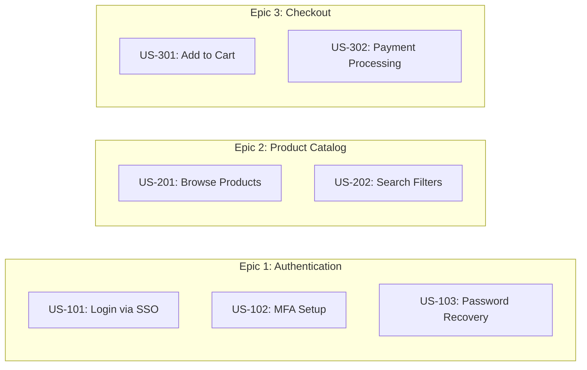

# Story Mapping

## Prerequisites

| Tool          | Check            | Install                                  |
| ------------- | ---------------- | ---------------------------------------- |
| Node.js >= 18 | `node --version` | [https://nodejs.org](https://nodejs.org) |
| npx           | `npx --version`  | Included with Node.js                    |

> mermaid-cli is auto-downloaded via `npx -y` — no manual install needed.

## When to Use

Use this skill when the user asks to create a story map, user story board,
epic breakdown, or backlog visualization. The output follows the Jeff Patton
story mapping format: personas across the top, epics as horizontal swim-lanes,
and user stories as cards within each epic, ordered by priority.

## Story Map Template (Markdown)

Generate a structured markdown document with this format:

```markdown
# Story Map: <Project Name>

> Author: Salesforce Professional Services | Version: 1.0

## Personas

| ID  | Persona | Description          |
| --- | ------- | -------------------- |
| P1  | <Name>  | <Role and key goals> |
| P2  | <Name>  | <Role and key goals> |

## Priority Legend

| Level | Label        | Criteria                          |
| ----- | ------------ | --------------------------------- |
| P1    | Must Have    | Critical for MVP / go-live        |
| P2    | Should Have  | High value, deferrable one sprint |
| P3    | Nice to Have | Enhances UX, not blocking         |

## Epic 1: <Epic Name>

| US ID  | User Story              | Persona | Priority | Acceptance Criteria      |
| ------ | ----------------------- | ------- | -------- | ------------------------ |
| US-101 | <As a P1, I want to...> | P1      | P1       | Given... When... Then... |
| US-102 | <As a P2, I want to...> | P2      | P2       | Given... When... Then... |

## Epic 2: <Epic Name>

| US ID  | User Story | Persona | Priority | Acceptance Criteria |
| ------ | ---------- | ------- | -------- | ------------------- |
| US-201 | ...        | ...     | ...      | ...                 |
```

### Numbering Convention

- Epic N user stories start at `US-N01` (e.g., Epic 3 → US-301, US-302...).
- Always use Gherkin (Given/When/Then) for acceptance criteria.

## Mermaid Diagram Generation

After producing the markdown, generate a Mermaid flowchart for visual
representation. Use subgraphs for epics and nodes for user stories.



### Diagram Rules

1. Node IDs must not contain spaces: use `US101`, not `US 101`.
2. Wrap labels with special characters in double quotes: `US101["US-101: Login"]`.
3. Use `graph LR` (left-to-right) for story maps; `graph TD` for flow diagrams.
4. Do NOT apply custom colors or styles -- let the default theme handle it.
5. Keep subgraph IDs lowercase without spaces: `subgraph epic1 [Epic 1: Name]`.

## Rendering to PDF

Save the Mermaid diagram to a `.mmd` file, then render using the included script:

```bash
bash .setup-agents/skills/story-mapping/scripts/render-pdf.sh story-map.mmd story-map.pdf
```

### Validation (CRITICAL)

After rendering, **always** check the output:

1. If the script exits with code 1 and prints "No diagram detected", the Mermaid
   syntax is invalid. Common fixes:
   - Ensure the file starts with a valid diagram type (`graph`, `flowchart`, `sequenceDiagram`).
   - Remove trailing whitespace or BOM characters.
   - Escape special characters in labels with double quotes.
2. Open the PDF and verify no content is truncated (cut off at edges).
   The included CSS (`assets/mermaid-pdf.css`) prevents this, but very wide
   diagrams may need `graph TD` instead of `graph LR`.
3. For markdown-embedded diagrams, verify the diagram renders in the markdown
   preview before committing.

## Integration with Docs

Every story map document placed in `/docs` must follow the documentation standard:

1. Start with the Salesforce Cloud logo header.
2. Author: **Salesforce Professional Services**.
3. Scan existing `/docs` files before creating -- update rather than duplicate.
